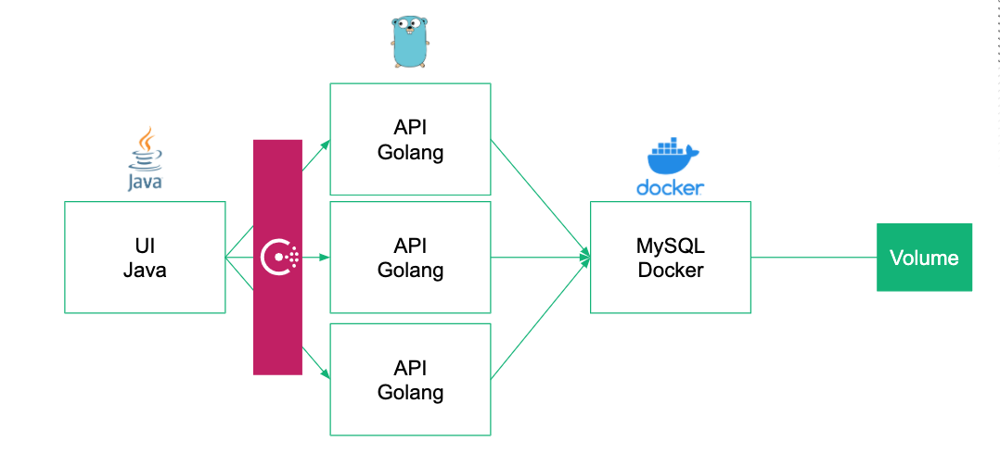
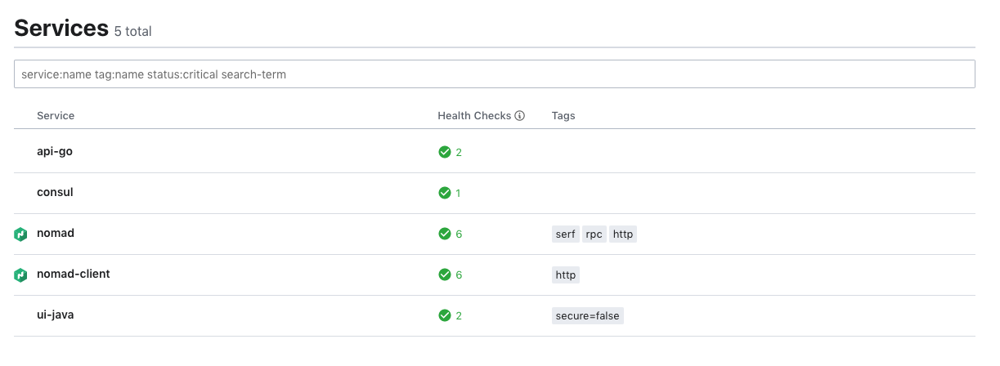

# Nomad Snapshots Demo



## Setup

1. Copy the configs

```sh
git clone https://github.com/tkaburagi/nomad-configs
cd nomad-configs
```

Change the path in the
* nomad-local-config-client-1.hcl
* nomad-local-config-client-2.hcl
* nomad-local-config-client-3.hcl
* nomad-local-config-server.hcl

2. Run Nomad

```sh
cat << EOF > run-cluster-local.sh
#!/bin/sh
pkill nomad
pkill java 

sleep 10

nomad agent -config=nomad-local-config-server-cluster.hcl &
nomad agent -config=nomad-local-config-client-1.hcl &
nomad agent -config=nomad-local-config-client-2.hcl &
nomad agent -config=nomad-local-config-client-3.hcl &
```

```sh
./run-cluster-local.sh
```

3. Run Consul
```sh
consul agent -dev
```

## Deploy MySQL

1. run
```sh
nomad job plan mysql.nomad
nomad job run mysql.nomad
```

2. insert data
```sql
create table auth_user (id varchar(50), username varchar(50));
insert into auth_user values ("1", "Peter");
insert into auth_user values ("2", "David");
insert into auth_user values ("3", "Ned");
insert into auth_user values ("4", "Masa");
```

## Deploy Go API

1. change the path in the `api-go.nomad`
2. change the MySQL address in the `api.go`
3. run
```sh
nomad job plan api-go.nomad
nomad job run api-go.nomad
```
4. test api by 
	* `curl http://127.0.0.1:55906/users`
	* `curl http://127.0.0.1:55906/versions`

Port number can be retrieved from Consul Web UI.

## Deploy Java API

1. run
```sh
nomad job plan ui-java.nomad
nomad job run ui-java.nomad
```
2. Browse
	* `http://127.0.0.1:8080`
	* `http://127.0.0.1:8080/api-location`

## Check the health
`http://127.0.0.1:8500`



## Try scale-out

1. change the `api-go`. `count = 5`

2. update job
```sh
nomad job plan api-go.nomad
nomad job run api-go.nomad
```

3. check Consul and `http://127.0.0.1:8080/api-location`

## Try auto-healing

1. check the pid
```
lsof -i:<one-of-the-api-port-from-consul-ui>
kill -9 PID
```

2. check Consul and `http://127.0.0.1:8080/api-location`

## Update job

1. watch job status in another terminal
```sh
watch -n 1 nomad job status api-go
```

2. version up to v2
```sh
nomad job plan api-go-v2.nomad
nomad job run api-go-v2.nomad
```

`http://127.0.0.1:8080/api-location`

3. watch the terminal until finishing

4. version up to v3 (failure)
```sh
nomad job plan api-go-v3.nomad
nomad job run api-go-v3.nomad
```

`http://127.0.0.1:8080/api-location`

5. watch the terminal
This update will be failed at the canary and update will be stopped.

6. version up to v4
```sh
nomad job plan api-go-v4.nomad
nomad job run api-go-v4.nomad
```

7. watch the terminal until canary is updated successfully

8. promote job
```ssh
nomad job promote api-go
```

9. watch the terminal until finishing

`http://127.0.0.1:8080/api-location`